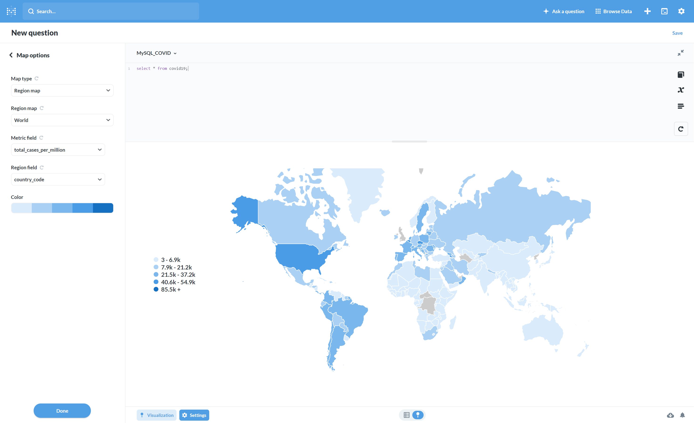

# ETL COVID-19 visualization
### I connected MySQL database, python script and MetaBase with docker compose to easily create beautifull dashboards from daily updated COVID-19 data.  

<br>
<br>
### how to run? <br>
```bash
docker-compose up
```
### from the directory where docker-compose.yml is.